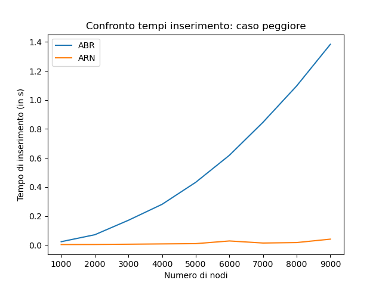
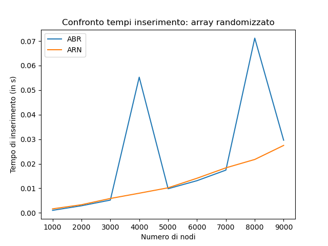
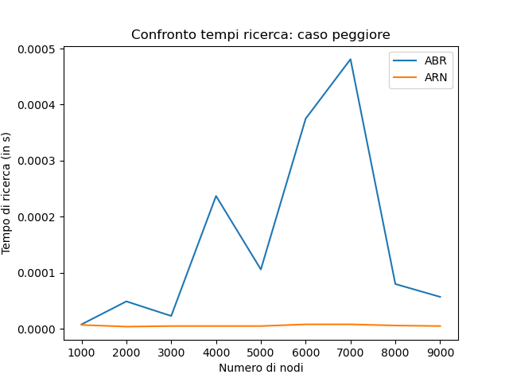
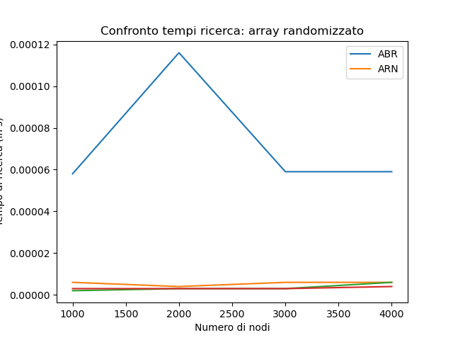
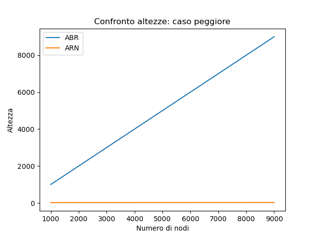
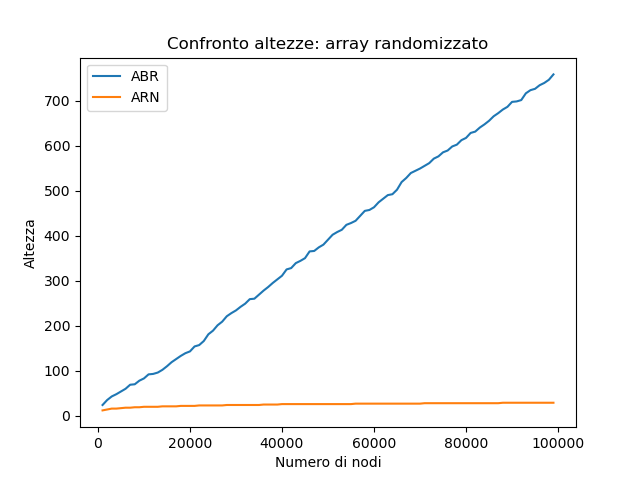

---
author:
- Leonardo Toccafondi   
date: February 14, 2022
title: Alberi binari di ricerca e alberi rosso-neri
---

# Introduzione

In questa relazione si andranno a confrontare alberi binari di ricerca e alberi rosso-neri, al fine di determinare le differenze, e di conseguenza i loro vantaggi e svantaggi, tra queste due strutture dati

# Descrizione teorica delle strutture dati

Un albero è una struttura dati composta da elementi, detti nodi: ognuno contiene una chiave che lo identifica univocamente. Inoltre, può contenere anche altri campi, come ad esempio un puntatore ai nodi *figli*. Il nodo dal quale discendono tutti gli altri nodi viene detto *radice* (in inglese root). Un nodo che non possiede figli è detto *foglia*. Viene definito *cammino* da un nodo un nodo n ad un nodo m una sequenza di nodi connessi da archi che portano da n ad m. La *lunghezza del cammino* è pari al numero di nodi che si incontrano nel cammino, escluso il primo. Di conseguenza la lunghezza di un cammino contenente un solo nodo è pari a 0. Si dice *altezza* $h$ dell’albero la lunghezza
massima tra i cammini che uniscono la radice alla foglie.
Un albero binario è un albero in cui ogni nodo ha *al massimo* due figli.

Si considera un albero binario di ricerca (abbreviato ABR o BST da binary search tree) come un albero binario ogni nodo è un oggetto con i campi key, left, right, p (rispettivamente la chiave, il puntatore al figlio sinistro, il puntatore al figlio destro e un puntatore al padre). I nodi dei un albero binario devono rispettare una proprietà: sia x un nodo e y un nodo del sottoalbero sinistro di x, allora $y.key \leq x.key$ . Viceversa se y è un nodo del sotto albero *destro* di x.
Il bilanciamento di un ABR dipende dall'ordine di inserimento dei nodi: nel caso di un inserimento ordinato (sia crescente che decrescente), l'albero sarà sbilanciato rispettivamente tutto a destra o tutto a sinistra. L’albero è perfettamente bilanciato quando ogni nodo, escluse le foglie, ha esattamente due figli.

Un albero rosso-nero (abbreviato ARN o RBT da red-black tree) è un ABR dove ogni nodo possiede anche un parametro per il colore. Quest'ultimo è un attributo booleano (x.colour) e può essere *rosso* o *nero*. Eredita tutti gli attributi di un ABR. In un ARN esistono le *foglie vuote* o *NIL*. Tra quest'ultime e le foglie nere vi è una relazione:

- ad ogni foglia di T è posta una sentinella T.nil

- il colore della foglia vuota è nero

- La foglia vuota è padre della radice

- Non interessa la chiave della foglia vuota   

In un albero rosso-nero sono soddisfatte le seguenti proprietà:

- Ogni nodo è rosso o nero

- La radice è nera

- Ogni foglia (T.nil) è nera

- Se un nodo è rosso, allora entrambi i suoi figli sono neri

- Tutti i cammini da ogni nodo alle sue foglie contengono lo stesso numero di nodi neri

Gli ARN garantiscono la non-esistenza di un qualsiasi cammino dalla radice ad una foglia qualsiasi che sia lungo più del doppio di qualsiasi altro. Ciò, insieme all'ultima proprietà che fa in modo che i nodi neri siano distribuiti nello stesso modo in tutti i cammini, rendono un ARN *bilanciato.*
Per un nodo di un albero rosso-nero è possibile definire due tipi di altezze: $h(x)$, che rappresenta l'altezza del nodo x, ovvero il numero di archi nel cammino più lungo fino ad una foglia; $bh(x)$ o *altezza nera*, pari al numero dei nodi neri (inclusa T.nil ed escluso x) nel cammino da x alla foglia. Queste servono a definire l'altezza di un albero rosso-nero con n nodi interni (ovvero con almeno una foglia): $h \leq 2 \lg(n+1)$

# Teoria a base degli esperimenti

Le operazioni che non vanno a modificare l'albero, come ad esempio la ricerca di un nodo sia per l'ABR che per l'ARN impiegano un tempo pari ad $\mathcal{O}(h)$, quindi hanno un costo proporzionale all'altezza dell'albero stesso. 

Nel caso peggiore per un albero binario di ricerca (che ricordiamo avvenire nel caso di un inserimento in ordine, con conseguente sbilanciamento dell'albero) abbiamo che l'altezza $h$ è pari al numero di nodi n - 1. Quindi tutte e tre le operazioni, nel caso peggiore per gli alberi binari di ricerca, necessitano di un tempo pari a $\mathcal{O}(n)$. Per alcune permutazioni dell’ordine degli inserimenti, l’albero risulta perfettamente bilanciato e $h = \mathcal{O}(lg(n))$. L’altezza è proporzionale al logaritmo del numero di nodi: ciò a grandi linee vale anche per gli inserimenti randomici, anche se con delle costanti di tempo maggiori.

Per quanto riguarda gli alberi rosso-neri, grazie alle loro proprietà riguardanti l'altezza, nel caso peggiore gli algoritmi impiegano un tempo pari a $\mathcal{O}(lg(n))$. Nel caso migliore

Dal momento che $\mathcal{O}(h)$ è il costo di un singolo inserimento di un nodo, il costo di $n$ inserimenti sarà pari a $\mathcal{O}(n*h)$,

# Descrizione ed implementazione degli esperimenti

Per confrontare queste due strutture dati, eseguiremo dei semplici test su due operazioni comuni: inserimento e ricerca di nodi. Inoltre, valuteremo anche l'altezza degli alberi risultanti.
Tutto questo sarà valutato all'aumentare del numero di nodi n, partendo da 1000 fino ad arrivare a 100000. I test saranno effettuati ogni 1000 nodi aggiuntivi.
Confronteremo gli ABR e gli ARN in base all'ordine in cui sono inseriti i nodi, considerando il "caso peggiore", ovvero con l'inserimento ordinato per determinare quanto più sia bilanciato l'albero rosso-nero rispetto all'albero binario di ricerca, e con un inserimento dello stesso vettore di nodi del caso peggiore, ma randomizzato per avvicinarci il più possibile al caso migliore per entrambi, anche se nel caso dell'ABR non abbiamo un albero completo.
Per quanto riguarda la ricerca, in entrambi i test viene generato un numero pseudorandomico compreso tra 1 e il numero di nodi della permutazione presa in considerazione, e ne viene effettuata la ricerca all'interno dell'albero.

Il programma che esegue il test è composto da 3 file python: due di questi, BST.py e RBT.py implementano le strutture dati e tutte le funzioni necessarie all'esperimento, tra cui anche le funzioni di trapianto e di "fixup" dell'inserimento per gli alberi rosso-neri. Infine abbiamo un file test.py che si occupa dello svolgimento dell'esperimento e della creazione dei grafici necessari alla visualizzazione dei risultati.

L'esperimento è stato svolto su un computer con le seguenti caratteristiche:

- Sistema operativo: Linux  Mint 21.1 con kernel 5.15

- CPU: Inter Core i7-9750h

- RAM: 16 GB 

- Interprete Python: conda 22.11.1

- IDE: Pycharm Community Edition 2022.3.2

# Risultati dell'esperimento

### Inserimento

### Ricerca

### Altezza

# Commento e conclusioni

Come possiamo vedere dai grafici, nel caso peggiore l'albero binario di ricerca ha delle performance peggiori, soprattutto nell'altezza, che da definizione è pari a $\mathcal{O}(n)$. Anche per l'inserimento e per la ricerca gli alberi rosso-neri impiegano un tempo decisamente minore rispetto agli alberi binari di ricerca.

Passando invece all'inserimento randomizzato, la differenza tra le due strutture si assottiglia notevolmente, anche nel caso della ricerca, rispettando la complessità $\mathcal{O}(logn)$.
Si nota tuttavia un miglioramento importante nelle altezze degli alberi binari di ricerca, avvicindandosi a quelle degli alberi rosso-neri.

In conclusione, risulta preferibile l'implementazione di alberi rosso-neri, a scapito di una maggiore semplicità di realizzazione degli ARN.